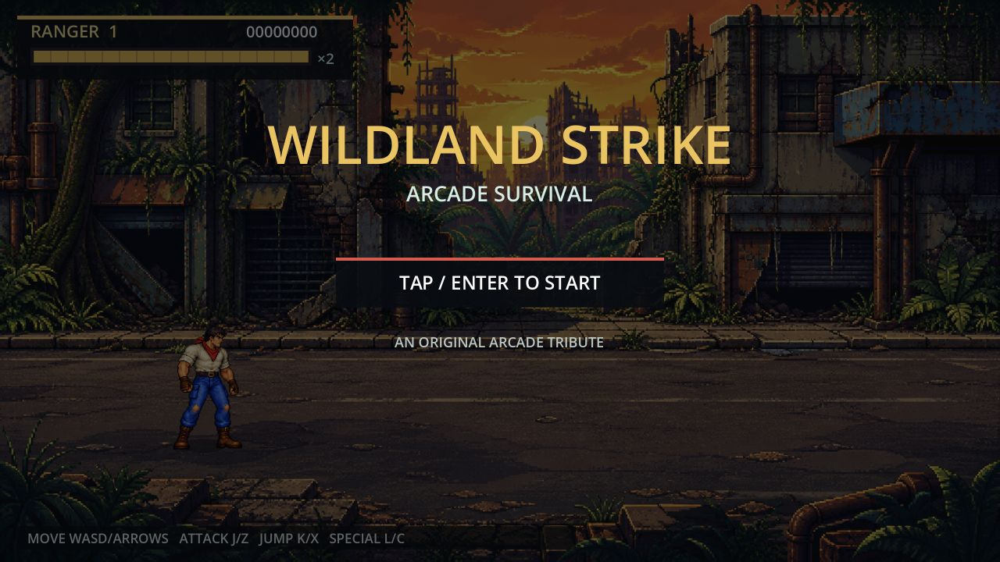
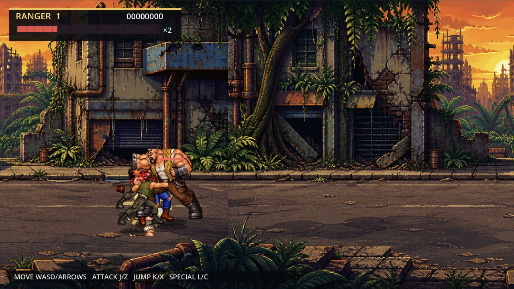

# M0 reproducible baseline

Captured: 2026-08-22 (Asia/Shanghai)

Source baseline: `f6c4f5f` plus the performance probe introduced by M0-06

Engine: Godot 4.7.1 stable

## Web

- Export: release, single-threaded Emscripten 4.0.20, WebGL 2 compatibility renderer.
- Public GitHub Pages load: title and playable idle scene rendered at 1280×720 CSS pixels with a 2560×1440 backing canvas; no browser console warnings or errors were reported.
- Performance scenario: `?baseline_benchmark=1` starts the current four-enemy wave after a 60-frame warm-up.
- Sample: 300 rendered frames on the local release export in the Codex in-app browser on this Mac's 120 Hz display.
- Result: 8.0193 ms average (124.70 FPS), 8.3333 ms P50/P95/P99, 0 frames over 20 ms, and 0 frames over 33.34 ms. A repeat after the final export averaged 7.9899 ms (125.16 FPS) with the same percentile and dropped-frame counts.
- Interpretation: the current scene exceeds the 60 FPS target on this browser. This is a baseline, not proof for the final campaign's heaviest encounter or for other devices.

## iOS

- Godot `iOS Device Debug` project export: passed.
- Toolchain: Xcode 26.6, iPhoneOS 26.5 SDK, minimum target iOS 15.0, arm64.
- Generic-device compile and link with signing disabled: passed; output is a valid arm64 Mach-O application bundle.
- Signed build: blocked because the local development provisioning profile is invalid and no matching profile is currently available.
- Device state: one iOS device is paired, but its tunnel is unavailable during this capture. Installation and launch were therefore not re-verified.
- Generated Xcode projects, DerivedData, application bundles, profiles, and signing material remain excluded from Git.

## Automated baseline

- `baseline_flow`: 11 assertions passed.
- `combat_rules`: 10 assertions passed.
- `performance_probe`: 9 assertions passed.
- Total: 30/30 assertions passed.

## Prioritized defect register

| ID | Priority | Area | Reproducible baseline | Planned owner |
|---|---|---|---|---|
| BASE-001 | P1 | Combat architecture | Player and enemy behavior use implicit timer combinations rather than explicit fighter states. | M1-01 |
| BASE-002 | P1 | Hit detection | Melee uses distance/lane checks rather than explicit hitboxes and hurtboxes. | M1-02 |
| BASE-003 | P1 | Crowd movement | Four-enemy benchmark can still produce substantial sprite overlap while enemies converge on one target. | M1 enemy navigation work |
| BASE-004 | P1 | Defensive special | Health is consumed on activation even when the special connects with no enemy; final contract requires cost only on hit. | M2-04 |
| BASE-005 | P1 | iOS delivery | Development provisioning is invalid and the paired device is currently unavailable, blocking a fresh signed install. | M9 release gate |
| BASE-006 | P2 | Content | Only one repeated-background strip and four waves exist; there is no campaign scene data. | M3, M6, M7 |
| BASE-007 | P2 | Presentation | Animation coverage is sparse, art is high-resolution pseudo-pixel work, and audio is synthesized cues without music. | M3, M8 |
| BASE-008 | P2 | Systems | No character select, multiplayer, firearm/ammo sandbox, vehicle, continue countdown, or high-score persistence exists. | M4–M8 |
| BASE-009 | P2 | Efficiency | Web rendering follows a 120 Hz display instead of capping at the 60 FPS product target; mobile power impact is not yet measured. | M8 performance tuning |

P0 defects: none observed in the current title-to-first-wave smoke path.
